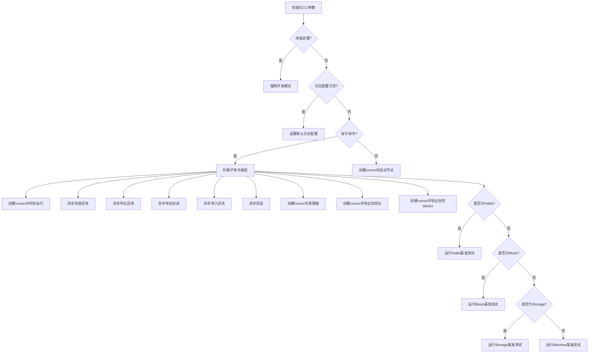

## command::run 程序主函数

**程序流图：**

```mermaid
flowchart TD
    A[初始化CLI参数] --> B{"未指定键?"}
    B -->|是| C[强制开发模式]
    B -->|否| D{"日志配置为空?"}
    D -->|是| E[设置默认日志配置]
    D -->|否| F{"有子命令?"}
    F -->|是| G[判断子命令类型]
    G --> BuildSpec[创建runner并同步运行]
    G --> CheckBlock[异步检查区块]
    G --> ExportBlocks[异步导出区块]
    G --> ExportState[异步导出状态]
    G --> ImportBlocks[异步导入区块]
    G --> Revert[异步回滚]
    G --> PurgeChain[创建runner并清理链]
    G --> ExportGenesisHead[创建runner并导出创世头]
    G --> ExportGenesisWash[创建runner并导出创世WASH]
    G --> Benchmark{"是否为Pallet?"}
    Benchmark -->|是| R[运行Pallet基准测试]
    Benchmark -->|否| S{"是否为Block?"}
    S -->|是| T[运行Block基准测试]
    S -->|否| U{"是否为Storage?"}
    U -->|是| V[运行Storage基准测试]
    U -->|否| W[运行Machine基准测试]
    F -->|否| X[创建runner并启动节点]
```

